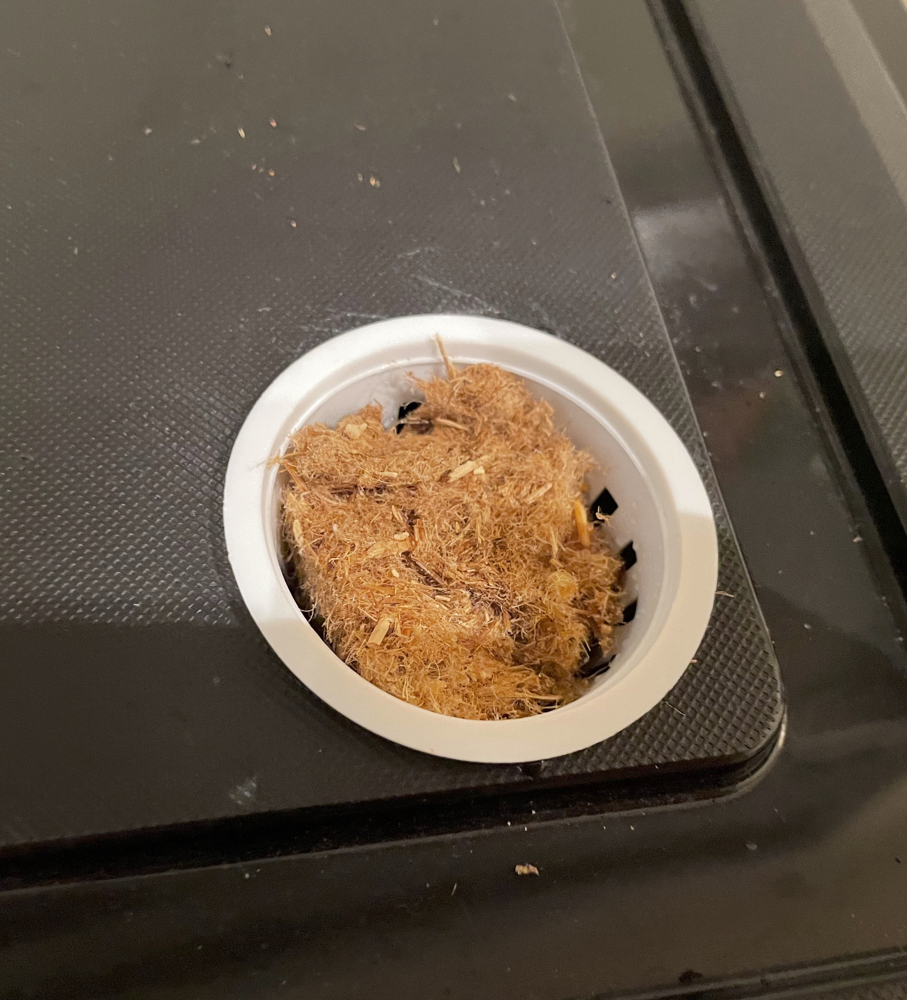
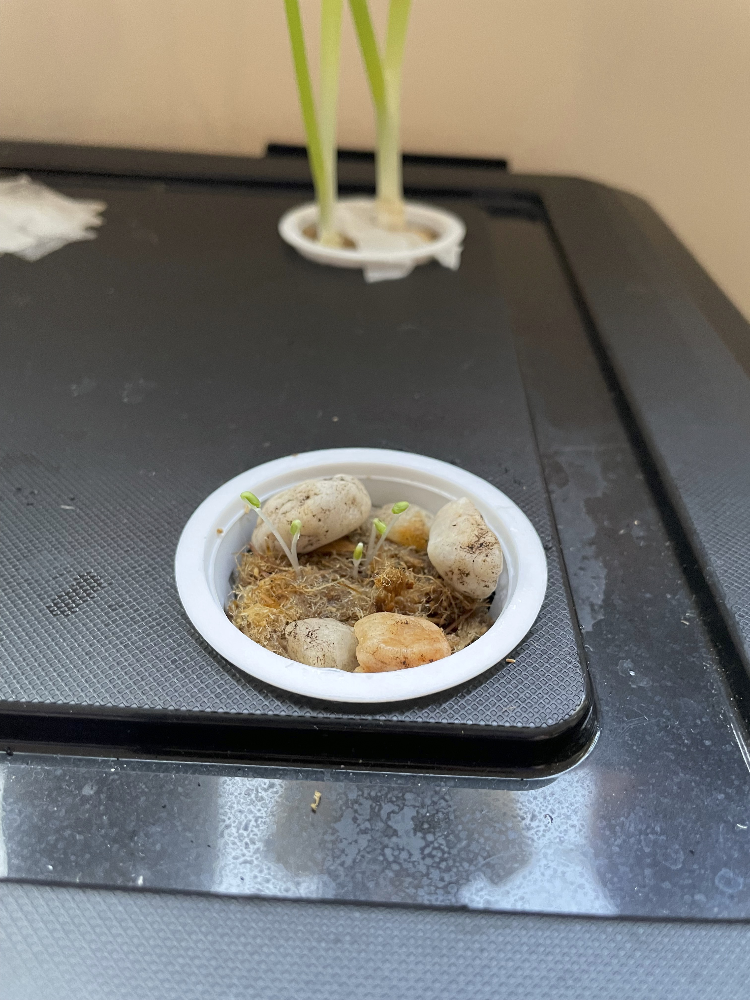
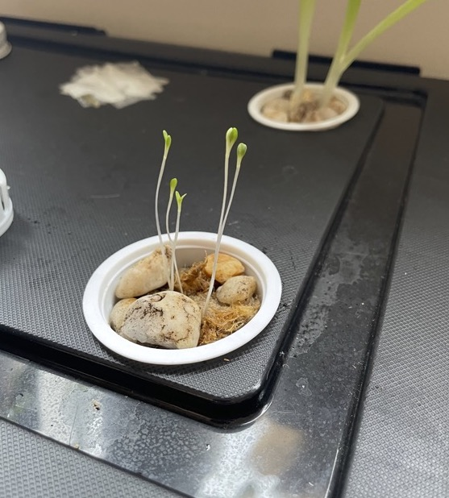

# Aeroponic System :seedling:

"Where we're going, we don't need soil" :shipit:

## Description

This project is my attempt to build a cheap alternative to the current options for at-home aeroponic systems that can cost upwards of $400.
That feels expensive, for a microcontroller, pump, and some plastic. I believe that the beauty in at-home farming is that it transfers the
power of affordable nutritious food from big businesses to the people who need it most.

## Current Iteration

This is hopefully the lowest fidelity version that I will have going forward, it is running on an Arduino Uno with a Real Time Clock module to
manage the timing of the pump. The pump is a regular Home Depot fountain pump and seems extremely overpowered, future versions can probably
have less expensive pumps. The PVC pipes are not glued for easy troubleshooting and configuration changes which leads to leaks, once a configuration
is decided the pipes will be glued. Due to not having the proper sized holesaw, the openings for the seeds have some minor leaks, but can be
fixed by simply purchasing a new set of holesaws.

| Day 1 | Day 7 | Day 9 |
| :----: | :----: | :----: |
|  |  |  |

## Future Iterations
